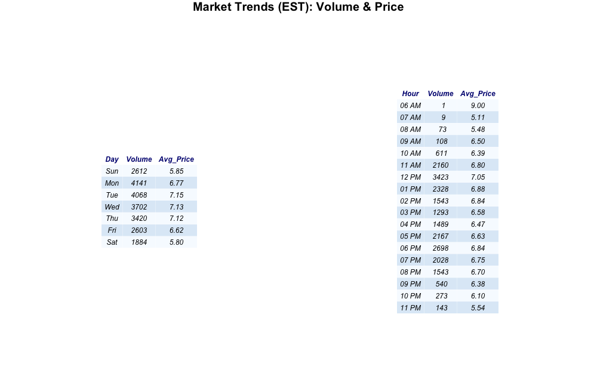

# CMU Block Market Analysis

An analysis of the Carnegie Mellon University dining block secondary market, where students (primarily first-years, who are obligated to purchase the university meal plan) trade excess meal swipes ("blocks") for cash (venmo, or zelle) via Discord.

## Market Overview

| Metric | Value |
|--------|-------|
| **Total Transactions** | 21,560 |
| **Total Dollar Volume** | $149,639 |
| **Average Price/Tx** | $6.94 |
| **Median Price/Tx** | $7.00 |
| **Unique Buyers** | 1,739 |
| **Unique Sellers** | 882 |
| **Date Range** | Aug 23 – Dec 18, 2025 |

*Note: Outliers (>$15/block) excluded from analysis.*

---

## Price Charts

### Daily Candlestick Chart with Volume
OHLC candlestick visualization showing price action and trading volume by day.

### 4-Hour Candlestick Chart
Higher granularity view of intraday price movements.

### Price Over Time (Line)
Simple line chart of average transaction price.

---

## Volume Analysis

### Volume by Price Level
Total blocks traded at each price point (rounded to nearest $0.50).

### Weekly Dollar Volume
Total value of transactions per week.

---

## Market Microstructure

### Price Footprint Heatmap
Daily distribution of transactions by price level. Darker = more volume.

---

## Time-Based Patterns

### Activity by Day & Hour
Summary of market activity patterns in EST.

### Transaction Volume by Hour
Distribution of transactions throughout the day (EST). Lunch (11a-1p) and Dinner (5p-7p) peaks are clearly visible.

### Transaction Volume by Day of Week
Monday is the busiest day, with activity tapering off towards the weekend.

### Activity Heatmap
Visualizing the "hot zones" for trading activity. Colors range from Yellow (low activity) to Black (high activity).

**Key Findings:**
- **Peak Hours**: 11 AM – 1 PM (lunch rush)
- **Highest Volume Days**: Monday, Tuesday, Wednesday
- **Weekend Discount**: Avg ~$5.80 on weekends vs ~$7 on weekdays

---

## Data Pipeline

1. **Raw Data**: Discord chat exports (JSON)
2. **Processing**: `process_market.py` — regex-based order extraction, troll filtering, transaction matching (explicit replies + time proximity)
3. **Output**: `cmu_block_market_transactions.csv`
4. **Analysis**: R scripts for visualization and statistics

### Transaction Matching Logic
- Prioritizes Discord reply feature for accurate buyer-seller matching
- Falls back to time-proximity matching (< 5 min window)
- Filters out trolls (price > $30, keywords like "trillion")
- Handles "bump" price updates, multi-block orders, flex additions

---

## Files

| File | Description |
|------|-------------|
| `process_market.py` | Main data processing script |
| `load_data.R` | R data loading helper |
| `market_tearsheet.pdf` | Summary statistics PDF |
| `price_*.png` | Price visualization charts |
| `volume_*.png` | Volume analysis charts |
| `top_participants.png` | Leaderboard visualization |

---

## License

Educational analysis only. Data sourced from public Discord channel.

