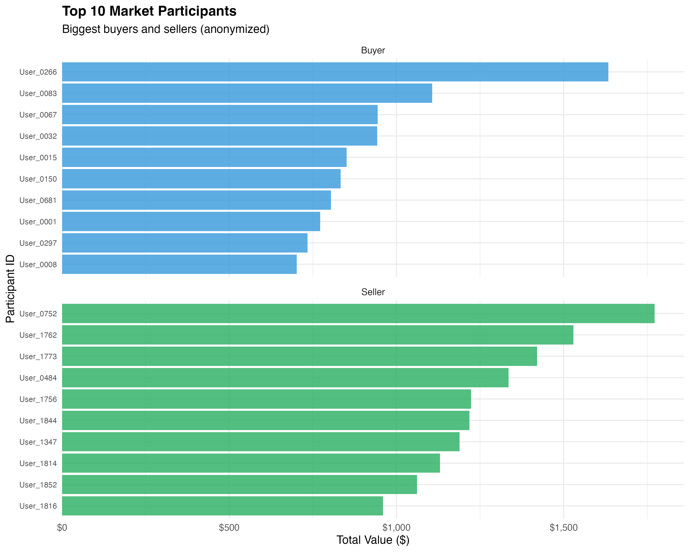

# CMU Block Market Analysis

An analysis of the Carnegie Mellon University dining block secondary market, where students (primarily first-years, who are obligated to purchase the university meal plan) trade excess meal swipes ("blocks") for cash via Venmo or Zelle through a Discord server.

---

## Market Overview

| Metric | Value |
|--------|------:|
| **Total Transactions** | 21,558 |
| **Total Blocks Traded** | 22,407 |
| **Total Dollar Volume** | $149,629 |
| **Market Duration** | 117 days |
| **Date Range** | Aug 23 – Dec 18, 2025 |

*Note: Outliers (>$15/block) excluded from price analysis.*

---

## Price Statistics

| Statistic | Value |
|-----------|------:|
| **Mean Price/Block** | $6.73 |
| **Median Price/Block** | $7.00 |
| **Standard Deviation** | $1.72 |
| **Minimum** | $0.50 |
| **Maximum** | $15.00 |

### Price Distribution (Quartiles)

| Percentile | Price |
|------------|------:|
| 25th (Q1) | $6.00 |
| 50th (Median) | $7.00 |
| 75th (Q3) | $8.00 |
| IQR | $2.00 |

---

## Participant Demographics

### Overview

| Role | Count | Median Activity | Median $ | Max $ |
|------|------:|----------------:|---------:|------:|
| **Buyers** | 1,738 | 6 blocks | $39 | $1,634 |
| **Sellers** | 882 | 16 blocks | $97 | $1,772 |

### Buyer Spending Distribution

| Percentile | Amount Spent |
|------------|-------------:|
| 25% | $13.00 |
| 50% (Median) | $39.00 |
| 75% | $107.50 |
| 90% | $228.07 |
| 95% | $325.72 |
| 99% | $618.55 |
| Max | $1,633.95 |

### Seller Earnings Distribution

| Percentile | Amount Earned |
|------------|-------------:|
| 25% | $24.50 |
| 50% (Median) | $97.00 |
| 75% | $220.75 |
| 90% | $415.05 |
| 95% | $615.66 |
| 99% | $978.94 |
| Max | $1,772.05 |

### Power Users

| Category | Count |
|----------|------:|
| Buyers with 50+ blocks | 79 |
| Buyers with 100+ blocks | 13 |
| Sellers earning $500+ | 64 |
| Sellers earning $1,000+ | 9 |

### Market Concentration

- **Top 10 buyers** account for **6.2%** of total spending
- **Top 10 sellers** account for **8.6%** of total earnings

> The market is relatively decentralized — no single participant dominates.

---

## Meal Time Breakdown

| Meal | Transactions | % of Market | Avg Price |
|------|-------------:|------------:|----------:|
| **Lunch** (10:30a–4:30p) | 11,434 | 53.0% | $6.82 |
| **Dinner** (4:30p–12a) | 9,838 | 45.6% | $6.66 |
| **Breakfast** (6a–10:30a) | 286 | 1.3% | $5.82 |

> **Insight**: Lunch dominates the market, but dinner commands nearly half of all transactions. Breakfast is negligible, likely due to limited meal plan options or students waking up later.

### Meal Preferences of Top Buyers


---

## Time-Based Patterns

### Weekday vs Weekend

| Day Type | Transactions | Avg Price | Volume |
|----------|-------------:|----------:|-------:|
| **Weekday** | 17,317 | $6.96 | $123,839 |
| **Weekend** | 4,241 | $5.82 | $25,790 |

> **Weekend Discount**: Prices drop ~16% on weekends ($5.82 vs $6.96 on weekdays).

### By Day of Week

| Day | Transactions | Volume (blocks) | Avg Price |
|-----|-------------:|----------------:|----------:|
| Mon | 3,989 | 4,135 | $6.74 |
| Tue | 3,935 | 4,062 | $7.13 |
| Wed | 3,574 | 3,698 | $7.11 |
| Thu | 3,308 | 3,417 | $7.10 |
| Fri | 2,511 | 2,602 | $6.62 |
| Sun | 2,476 | 2,610 | $5.84 |
| Sat | 1,765 | 1,883 | $5.79 |

### Peak Trading Hours (EST)

| Hour | Transactions | Avg Price |
|------|-------------:|----------:|
| **12 PM** | 3,339 | $7.05 |
| **6 PM** | 2,590 | $6.84 |
| **1 PM** | 2,262 | $6.88 |
| **11 AM** | 2,094 | $6.79 |
| **5 PM** | 2,061 | $6.62 |


### Activity Heatmap

Visualizing "hot zones" for trading. Yellow indicates low activity, while black indicates high activity.


---

## Top Weeks by Dollar Volume

| Week Starting | Transactions | Blocks | Dollar Volume | Avg Price |
|--------------|-------------:|-------:|--------------:|----------:|
| Nov 30 | 3,014 | 3,159 | $17,594 | $5.59 |
| Nov 16 | 2,151 | 2,228 | $14,449 | $6.50 |
| Nov 9 | 2,095 | 2,172 | $14,283 | $6.60 |
| Dec 7 | 2,617 | 2,817 | $13,245 | $4.74 |
| Nov 2 | 1,407 | 1,448 | $9,987 | $6.91 |

> **November/December Surge**: The end of the semester sees massive trading volume as students with excess blocks attempt to offload them before plans reset.


---

## Price Charts

### Daily Candlestick Chart with Volume

OHLC candlestick visualization showing price action and trading volume by day.


### Price Footprint Heatmap

Daily distribution of transactions by price level. Darker regions represent higher volume. This visualization helps identify price consolidation zones and high-activity price levels over time.


### 4-Hour Candlestick Chart

Higher granularity view of intraday price movements.


### Price Over Time (Line)


---

## Volume Analysis

### Volume by Price Level

Total blocks traded at each price point (rounded to nearest $0.50).


---

## Market Participants

### Top Buyers & Sellers by Dollar Volume



### Top Buyers by Block Volume


### Top Sellers by Earnings


---

## Data Pipeline

```
Discord JSON → process_market.py → CSV → R Analysis → Visualizations
```

1. **Raw Data**: Discord chat exports (JSON)
2. **Processing**: `process_market.py` — regex-based order extraction, troll filtering, transaction matching
3. **Output**: `cmu_block_market_transactions.csv`
4. **Analysis**: R scripts for visualization and statistics

### Transaction Matching Logic

- Prioritizes Discord reply feature for accurate buyer-seller matching
- Falls back to time-proximity matching (< 5 min window)
- Filters out trolls (price > $30, keywords like "trillion")
- Handles "bump" price updates, multi-block orders, and flex additions

---

## Files

| File | Description |
|------|-------------|
| `process_market.py` | Main data processing script |
| `load_data.R` | R data loading helper |
| `market_tearsheet.pdf` | Summary statistics PDF |
| `price_*.png` | Price visualization charts |
| `volume_*.png` | Volume analysis charts |
| `top_*.png` | Participant leaderboards |
| `hist_*.png` | Distribution histograms |
| `heatmap_*.png` | Activity heatmaps |

---

## License

Educational analysis only. Data sourced from public Discord channel.

---

*Analysis by [@chungderson](https://github.com/chungderson)*
